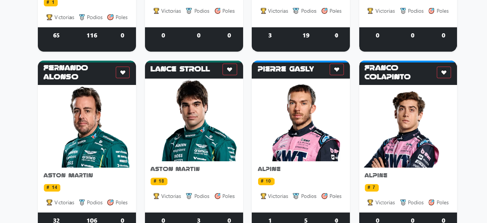
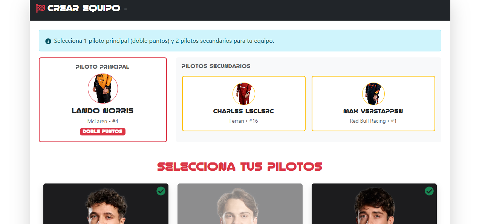

## Tecnologías usadas

- React
- Node.js + Express
- MongoDB
- Joi (validación)  
- JWT (autenticación)
- Axios (para hacer peticiones)
- Nodemon (para reiniciar el servidor)
- Bcrypt (para encriptar contraseñas)
- CORS (para permitir peticiones cross-origin)
- dotenv (para variables de entorno)
- Express (para crear el servidor)
- Mongoose (para interactuar con MongoDB)
- Bootstrap (estilos)
- Multer (para subir imágenes)
- API externa de resultados (Jolpica)

---

## Screenshots 

### Página de Inicio


### Panel de Drafts


### Panel de Admin para importar resultados


---

## Instalación local

```bash
git clone https://github.com/tu-usuario/f1-app.git
cd f1-app
cd backend && npm install && npm start
cd frontend && npm install && npm run dev

